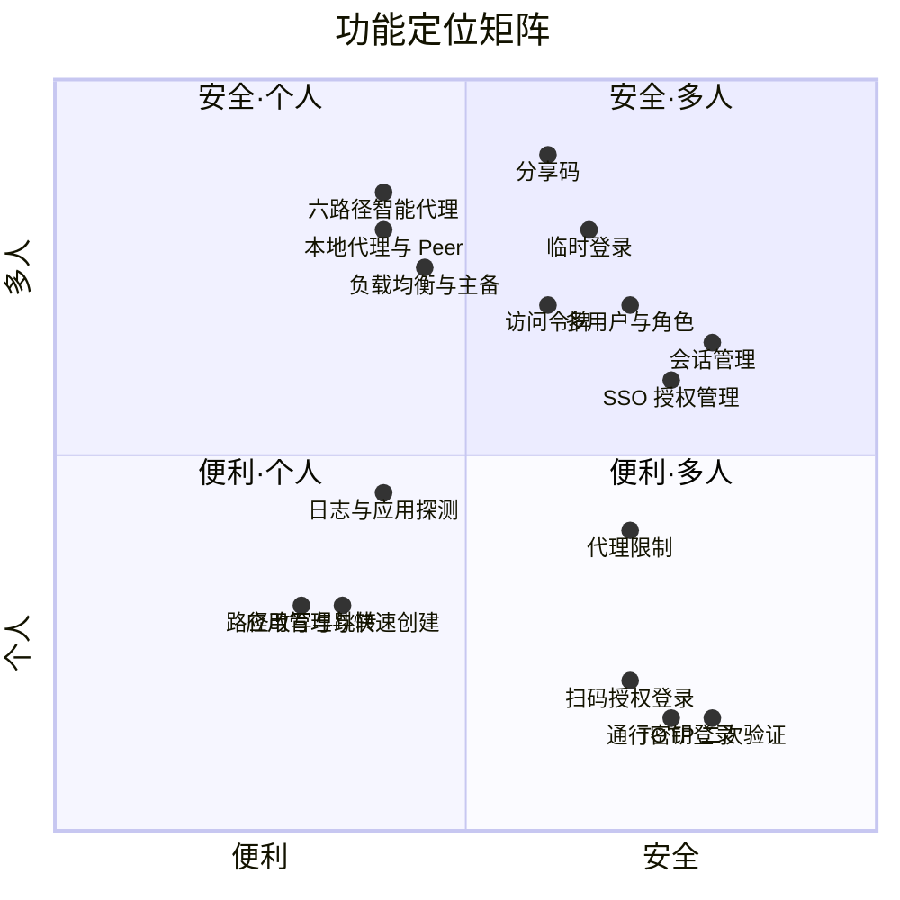

# 6 - 功能矩阵与业界对标

> 本文从产品视角管理全系统能力：现有功能、属性定位、业界替代品、规划方向。
>
> **维护方式**：新增功能 = 在「功能属性矩阵」加一行；规划中的功能先追加到最后一组「规划与讨论」，实现后移到对应功能域；象限图按需加点。

## 1. 属性标签体系

### 价值属性（功能解决什么问题）

| 标签 | 含义 | 典型功能 |
|------|------|----------|
| 安全 | 防未授权访问、防泄漏、防提权 | 通行密钥登录、SSO、分享码 |
| 便利 | 减少操作步骤、降低使用门槛 | 扫码登录、链接识别、快速创建 |
| 性能可靠 | 低延迟、高可用、不丢数据 | 六路径代理、连接池、负载均衡 |
| 可观测 | 看得见、可追溯、可排障 | 日志、request_id、应用探测 |
| 可管理 | 配置、审计、运维动作 | 会话管理、用户角色、客户端管理 |

### 使用形态（功能面向谁）

| 标签 | 含义 |
|------|------|
| 个人 | 只服务自己（管理员本人） |
| 多人共享 | 多个已授权用户使用 |
| 对外分享 | 面向未注册的外部人 / 机器 |
| 通用 | 面向所有流量、无特定人群语义 |

## 2. 功能属性矩阵

| 功能 | 价值属性 | 使用形态 |
|------|----------|----------|
| **认证与登录** | | |
| 密码登录 + JWT 会话 | 安全·便利 | 个人 |
| 通行密钥登录（passkey，可发现凭据免密） | 安全·便利 | 个人 |
| TOTP 两步验证 | 安全 | 个人 |
| 扫码授权登录（手机扫码 + 生物识别，仅发应用 SSO） | 安全·便利 | 个人（跨设备） |
| 临时登录（PIN + TOTP 一次性换 SSO，防重放） | 安全·便利 | 对外 |
| 会话 Cookie 模式（持久 / 关浏览器失效） | 安全 | 个人 |
| 登录限流 | 安全 | 通用 |
| **分享与授权** | | |
| 分享码（限有效期·限跳转次数·限路径） | 安全·便利 | 对外 |
| 分享码二维码（本地生成） | 便利 | 对外 |
| 粘贴链接自动识别填表 | 便利 | 个人 |
| 访问令牌（Bearer，程序化访问） | 安全·便利 | 对外 |
| SSO 应用授权管理（授予 / 撤销） | 安全 | 多人共享 |
| SSO 二次验证（授权时 passkey 断言） | 安全 | 个人 |
| 外部只读 API（独立 token） | 便利 | 对外 |
| **代理与路由** | | |
| 六路径智能代理（本机/隧道/本地/peer/中转/隧道+peer） | 性能可靠 | 通用 |
| 负载均衡 / 主备故障转移 | 性能可靠 | 多人共享 |
| 子域名模糊匹配（通配 / 正则段 / 全锚定） | 便利 | 通用 |
| 路径改写 | 便利 | 通用 |
| 跳转规则 | 便利 | 通用 |
| 路由级认证覆盖（按 method + path） | 安全·便利 | 多人共享 |
| SSO 豁免路径 | 便利 | 通用 |
| 内置变量模板（`${host}`、`${subdomain}` 等） | 便利 | 通用 |
| 代理限制（body 大小 / 超时等 8 项，两级合并） | 安全·性能可靠 | 通用 |
| 出站头处理（header_mode 三档） | 安全 | 通用 |
| **客户端与网络** | | |
| 连接池（4 连接轮换 / 背压） | 性能可靠 | 通用 |
| 本地代理（Path 3，内网低延迟直连） | 性能·便利 | 多人共享 |
| Peer 直连（Path 4/6，客户端间 P2P） | 性能 | 多人共享 |
| agent 加密传输（Noise_KN） | 安全 | 通用 |
| 出站代理拨号（SOCKS5 / Shadowsocks） | 便利 | 通用 |
| 客户端管理（注册 / 踢下线 / 连接详情） | 可管理 | 多人共享 |
| **运维与可观测** | | |
| 应用探测（每分钟健康状态） | 可观测 | 通用 |
| 日志（按天滚动 / 筛选 / 流式 / 下载） | 可观测 | 通用 |
| request_id 全链路追踪 | 可观测 | 通用 |
| 会话管理（审计 / 强制下线） | 安全·可观测 | 多人共享 |
| **管理体验** | | |
| 应用管理（克隆 / 快速创建） | 便利·可管理 | 个人 |
| 多用户与角色（admin / guest） | 可管理 | 多人共享 |
| 站点设置（域名 / 会话期 / 密钥） | 可管理 | 个人 |
| 前端体验（表头筛选 / loading / 排序） | 便利 | 个人 |
| **规划与讨论（未实现）** | | |
| 受限边缘缓存（issue #65 讨论） | 性能可靠 | 通用 |
| 代理失败重试（issue #69 讨论，proxy_retry_count） | 性能可靠 | 通用 |
| 连接器小工具（issue #79 讨论，未定） | 便利 | 个人 |

## 3. 定位象限图

横轴：便利 ↔ 安全；纵轴：个人 ↔ 多人。坐标为相对定位示意，用于总览分布，不必精确。

## 4. 业界对标（Build vs Buy）

### 4.1 Cloudflare 对位产品

| Cloudflare 产品 | 对应我们的能力 |
|-----------------|----------------|
| Cloudflare Tunnel（cloudflared） | 隧道代理（Path 2） |
| Cloudflare Access | SSO 门控、路由级策略、豁免路径 |
| Access Service Tokens | 访问令牌 |
| One-time PIN（邮箱 OTP） | 临时登录（近似） |
| Cloudflare Mesh（2025 新产品） | Peer 直连（形态不同，近似） |
| Load Balancing | 负载均衡 / 主备 |
| Transform / Redirect Rules | 路径改写、跳转、出站头处理 |
| Health Checks + DEX | 应用探测 |
| Logpush + Log Explorer | 日志系统 |
| Rate Limiting | 限流、代理限制 |
| 账号 passwordless（WebAuthn） | 通行密钥登录 |

### 4.2 可直接替代（有成熟产品，几乎零胶水）

| 我们的功能 | 替代品 |
|------------|--------|
| 隧道代理（Path 2） | Cloudflare Tunnel / frp / ngrok / zrok / sish |
| SSO 门控 + 路由级策略 + 豁免路径 | Cloudflare Access / Authelia / Authentik / Pomerium / oauth2-proxy |
| 通行密钥登录 | Authelia / Authentik / Hanko（WebAuthn） |
| TOTP 两步验证 | Authelia / Authentik |
| 临时登录 | CF One-time PIN / Authelia 随机密码 |
| 访问令牌 | CF Service Tokens / oauth2-proxy |
| 负载均衡 / 主备 | CF Load Balancing（付费）/ Nginx / HAProxy |
| 路径改写 / 跳转 / 出站头 / 豁免路径 | CF Rules / Nginx / Caddy / Traefik |
| 限流 / 代理限制 | CF Rate Limiting / Nginx limit_req / Authelia regulation |
| 应用探测 | CF Health Checks / Uptime Kuma / Gatus |
| 日志（滚动/筛选/流式） | CF Logpush + Log Explorer / Grafana Loki + Alloy / Dozzle |
| request_id 全链路 | CF-Ray / OpenTelemetry |
| 会话管理（审计 / 强下线） | CF Access session revoke / Authentik / Keycloak |
| 多用户与角色 | CF Access groups / Keycloak / Authentik |
| 客户端管理 / 连接详情 | CF Dashboard / frp admin / Tailscale admin |

### 4.3 需拼装（无单一产品，2+ 组合 + 胶水）

| 我们的功能 | 拼装方案 | 缺口 |
|------------|----------|------|
| 本地代理 + Peer 直连 | Tailscale / NetBird / ZeroTier（P2P 组网）+ 自建路由 | 同域名"内外网自动分流"拼不出来 |
| agent 加密传输 | WireGuard（Tailscale） | 需自行接线到代理链路 |
| 分享码 | CF Access 短期 OTP + session duration | 缺限次数 / 限路径约束 |
| 临时登录（PIN+TOTP 双因素） | CF One-time PIN | 单因素，缺防重放设计 |

### 4.4 无等价（自研独有，买不到）

1. **六路径智能选择**——CF 只有"全走边缘"一条路；Tailscale 有 P2P 但无"同一子域名按来源智能选路"
2. **扫码授权登录**——授权语义由自建页面约束、防提权（设计原则见 #71），业界跨设备配对码方案有提权隐患
3. **分享码三维约束**——有效期 + 跳转次数 + 限定路径，无同类产品
4. **统一网关多应用子域名**——一个面板管全部应用的子域 / 认证 / 路由 / 日志

### 4.5 结论

- 约 **75%** 的功能可被现成产品替代（认证、限流、LB、日志、探测等常规能力）
- 自研价值集中在 **多路径混合** 与 **分享 / 扫码的授权语义**，约 25%
- 整机替代选项：**Pangolin**（最相似的开源产品：self-hosted、identity-aware、WireGuard）、**CF Tunnel + Access**（托管方案，但引入海外边缘依赖，国内访问质量差——这正是自研的根本动机之一）
